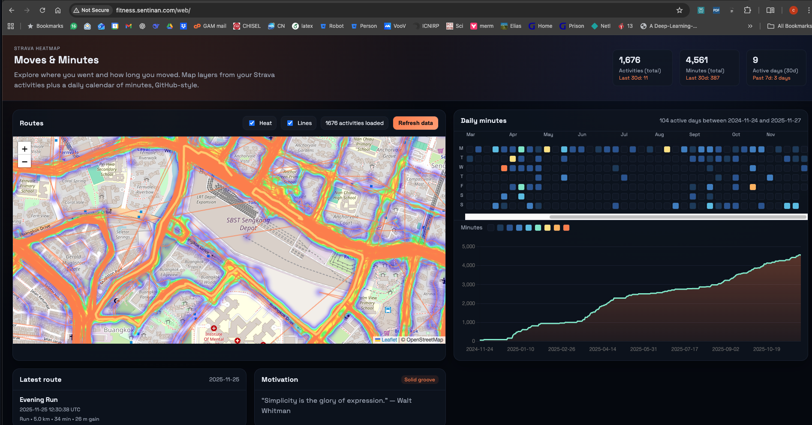

# Strava Activity Heatmap

Turns your Strava activities into an interactive heatmap plus a running-analysis UI so you can explore routes, inspect detailed heart rate and pace, and review fitness trends over time.



## What it does
- Pulls activities from the Strava API using your own OAuth app and refresh token.
- Expands the encoded activity polylines into GeoJSON and merges them into a heat layer.
- Keeps a local cache so subsequent syncs are incremental and stay within Strava rate limits.
- Caches detailed run streams when available (`heartrate`, `time`, `distance`, `velocity_smooth`, `moving`).
- Generates `data/fitness_analysis.json` for longitudinal running analysis.
- Ships an interactive UI (desktop and mobile friendly) with:
  - a dashboard heatmap and run-history inspector
  - a separate analysis page with fitness and efficiency charts
- Can export a static bundle for sharing without exposing your Strava credentials.

## Prerequisites
- Strava account and an API application (create one at https://www.strava.com/settings/api).
- Refresh token with `read_all` and `activity:read_all` scope for the athlete whose data you want to plot.
- Runtime: use the language/tooling defined in this repo; the examples below assume a Python-based fetcher plus a web front end.

## Configure Strava access
1. Create a Strava API app. Set the Authorization Callback Domain to `localhost` (or the host you plan to use).
2. Authorize your account to get a one-time code (replace placeholders):
   ```
   https://www.strava.com/oauth/authorize?client_id=YOUR_CLIENT_ID&response_type=code&redirect_uri=http://localhost:3000/auth/strava&approval_prompt=force&scope=read,activity:read_all
   ```
3. Exchange the code for a long-lived refresh token:
   ```
   curl -X POST https://www.strava.com/oauth/token \
     -d client_id=$STRAVA_CLIENT_ID \
     -d client_secret=$STRAVA_CLIENT_SECRET \
     -d code=THE_CODE_YOU_GOT \
     -d grant_type=authorization_code
   ```
   Save the `refresh_token` from the response.
4. Add your secrets to a `.env` (or your secret manager):
   ```
   STRAVA_CLIENT_ID=xxxx
   STRAVA_CLIENT_SECRET=xxxx
   STRAVA_REFRESH_TOKEN=xxxx
   PORT=3000
   ```
   Keep `.env` out of git. Tokens in this repo are sample values only; rotate real tokens if they were shared.

## Running locally
The workflow is fetch -> render -> view.
- Install deps: `python -m pip install -r requirements.txt`.
- Pull activities and cache them locally: `python fetch_strava.py --after 2024-01-01` (writes `data/activities_raw.json`, `data/activities.geojson`, and `data/fitness_analysis.json`). If `--after` is omitted and a cache exists, the script auto-uses the latest cached start_date to fetch incrementally.
- The fetcher also backfills detailed streams for up to the most recent 100 `Run` activities that already show HR in the summary data but do not yet have a local stream cache. Those files are written under `data/activity_streams/<activity_id>.json`. Adjust with `--stream-backfill-limit`, or use `--stream-backfill-limit 0` to skip stream backfill.
- Serve the UI via the Node server (static + quote proxy): `npm install` then `npm run serve` (uses PORT env var, default 8000) and open:
  - dashboard: `http://localhost:${PORT:-8000}/web/`
  - analysis: `http://localhost:${PORT:-8000}/web/analysis.html`
- One-shot helper: `AFTER=2024-01-01 ./scripts/deploy_local.sh` (auto-creates `.venv`, installs deps, loads `.env`, fetches, then serves on `http://localhost:${PORT:-8000}/web/` via `node server.js`).
- In the UI, the “Refresh data” button POSTs to `/refresh` to run `fetch_strava.py` on the server, then reloads the cached files. The server will use `.venv/bin/python3` if present, else `FETCH_PYTHON` env, else `python3`; ensure dependencies from `requirements.txt` are installed and Strava env vars are configured on the host running `server.js`.
- During refresh, the server now also caches detailed streams for the latest missing HR-enabled runs rather than trying to backfill all historical runs in one shot, which helps stay under Strava rate limits.
- After refresh, the dashboard message explicitly reports the date range of the detailed HR stream files newly cached in that refresh, or says that none were newly cached.
- Quick local start: `FETCH=1 AFTER=2024-01-01 PORT=8000 ./scripts/start_local.sh` (creates `.venv` if missing, installs Python/node deps, optionally fetches, then runs `node server.js`).

### UI overview
- `Dashboard` / `Analysis` is the page switch in the header on both pages.
- Dashboard (`/web/`):
  - route heatmap and activity stats
  - full run history list
  - detailed HR/pace chart for a selected run when stream data is cached or fetched on demand
- Analysis (`/web/analysis.html`):
  - combined `Fitness Trend` chart with zone lines for:
    - `120-140`
    - `141-150`
    - `151-160`
    - `>160`
  - `Efficiency at HR` chart
  - `Explain` hover labels beside both charts
  - mouse drag to zoom the date range, with start/end fields filled from the selection
  - translucent selection band while dragging
  - `Reset Zoom` or double-click to return to the full range

### Refreshing Strava tokens / scopes
- Build an auth URL: `python scripts/strava_auth_helper.py` (uses `STRAVA_CLIENT_ID/SECRET` from `.env`).
- Open the URL, approve with scopes `read,activity:read_all`, then copy the `code` from the redirect.
- Exchange the code: `python scripts/strava_auth_helper.py --exchange PASTE_CODE_HERE`
- Paste the printed `STRAVA_ACCESS_TOKEN`, `STRAVA_ACCESS_TOKEN_EXPIRES_AT`, and `STRAVA_REFRESH_TOKEN` into `.env`.
- Verify scopes quickly: `python scripts/check_token_scopes.py` (should include `activity:read_all`).
- One-shot version: `python scripts/bootstrap_strava_token.py` starts a local listener, opens the auth URL, captures the code automatically, exchanges it, and writes tokens into `.env`. Use `--redirect-uri` to match your Strava app settings if you changed it (default `http://localhost:3000/auth/strava`).

## Remote deploy
- Ensure your `.env` has valid STRAVA tokens (with `activity:read_all`) and is present locally so it can be synced.
- Deploy over SSH (rsync + remote venv + fetch + serve):  
`./scripts/deploy.sh --host sentinan-dsp --port 8020 --user ubuntu --path /home/ubuntu/strava-heatmap --after 2024-01-01 --start-server 1 --server-name fitness.sentinan.com --ssl-email you@example.com`  
Positional fallback: `./scripts/deploy.sh sentinan-dsp 8020` (defaults: host=sentinan-dsp, user=ubuntu, path=/home/ubuntu/strava-heatmap, port=8020, server_name=fitness.sentinan.com).  
On the remote it will rsync the project, build a venv, run `fetch_strava.py`, install npm deps, set up systemd (`strava-heatmap.service`) running `node server.js` on port 8020 (serves static + /quote proxy), and configure nginx on port 80 to proxy to 127.0.0.1:8020.  
- HTTPS is enabled by default (Let’s Encrypt via certbot/nginx). Provide `--ssl-email you@example.com`; ensure DNS for `--server-name` points at the host and ports 80/443 are reachable. To skip HTTPS, pass `--enable-ssl 0`.
- After deploy with server start, open `https://your.server/web/` (HTTP redirects to HTTPS). The data folder lives under `REMOTE_PATH/data/`. Logs are in the journal for the systemd service.

## Data flow
- Strava API -> local cache (`activities_raw.json`, `activities.geojson`, `activity_streams/*.json`, `fitness_analysis.json`) -> dashboard and analysis UI.
- Incremental syncs help stay under Strava rate limits; keep cached data out of git.
- Keep your Strava privacy zones enabled and avoid publishing raw GPS tracks.

## Troubleshooting
- `401 Unauthorized`: refresh tokens expire if access is revoked; re-run the OAuth flow.
- Missing paths: ensure your `.env` is loaded before running the fetcher.
- Empty map: verify activities have GPS streams.
- Analysis page has no charts: regenerate `data/fitness_analysis.json` by running `fetch_strava.py` or pressing `Refresh data`.
- Older years show summary fallback instead of stream-backed trend points: detailed HR may exist in Strava but not yet be cached locally under `data/activity_streams/`; refresh only backfills a bounded recent set and on-demand fetching happens when you inspect an individual run.

## Roadmap
- Sport/date filters and activity type toggles.
- CI check to keep secrets and caches out of commits.
- Optional static export for sharing without credentials.
